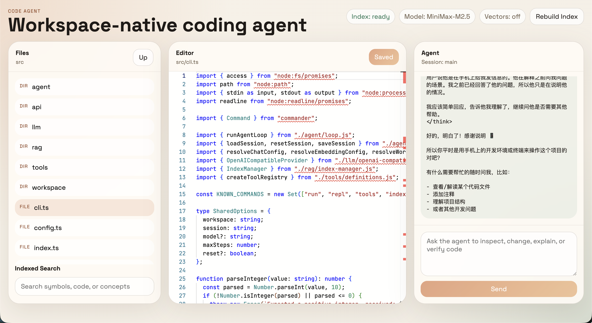

# Mobile Code Agent



一个适合手机联网使用的 AI 写代码工具。它提供了类似 VS Code 的网页界面、Monaco 编辑器、代码索引搜索和带工具调用能力的 Agent 后端。你可以直接在手机上打开它，躺着查看项目、改代码、跑检查，并让 AI 帮你写代码。

[English README](./README.md)

## 项目特性

- React 网页界面，支持 Monaco 编辑器
- Express API 服务端
- 可调用工具的 coding agent 循环
- 本地会话持久化
- 工作区边界内的安全文件读写工具
- 本地代码索引与搜索能力，包括：
  - 启发式语义分块
  - 类 BM25 关键词检索
  - 可选的向量检索
  - 混合 RRF 融合排序
  - 文件监听与自动重建
- CLI 入口，支持单次任务、REPL、索引重建和搜索

## 模型配置

项目默认按 MiniMax M2.5 配置。

```bash
cp .env.example .env
```

最少需要配置聊天模型：

```bash
MINIMAX_API_KEY=your_minimax_api_key
CHAT_BASE_URL=https://api.minimaxi.com/v1
CHAT_MODEL=MiniMax-M2.5
```

如果你想启用向量检索，可以额外配置：

```bash
EMBEDDING_API_KEY=your_embedding_key
EMBEDDING_BASE_URL=https://your-openai-compatible-embedding-endpoint/v1
EMBEDDING_MODEL=your-embedding-model
```

如果不配置 embedding，项目依然可以正常运行，只是只使用关键词检索。

## 启动方式

先安装依赖：

```bash
npm install
```

启动后端：

```bash
npm run dev
```

启动前端：

```bash
npm run dev:web
```

生产构建：

```bash
npm run build
npm start
```

默认地址是：

- `http://127.0.0.1:3000`

## 局域网 / 手机访问

如果你想让手机或局域网里的其他设备访问，可以配置：

```bash
CODE_AGENT_HOST=0.0.0.0
CODE_AGENT_PORT=3000
```

然后通过下面这种地址打开：

- `http://<你的电脑IP>:3000`

如果你使用的是 Vite 开发前端，也可以这样开放前端：

```bash
CODE_AGENT_WEB_HOST=0.0.0.0
CODE_AGENT_WEB_PORT=5173
```

然后通过：

- `http://<你的电脑IP>:5173`

这种模式很适合在手机上直接操控 Agent，让它查看项目、改注释、写功能、跑检查。

## 对外暴露时的安全建议

这个项目可以直接读取和修改工作区文件，所以如果你要开放到局域网之外，一定要加保护。

至少建议配置：

```bash
CODE_AGENT_AUTH_TOKEN=换成一串足够长的随机字符串
```

配置后可以这样打开网页：

- `http://<你的电脑IP>:3000/#token=你的token`

如果是 Vite 开发模式：

- `http://<你的电脑IP>:5173/#token=你的token`

浏览器首次加载后会把 token 存到本地存储里，并自动从地址栏里移除。

## Docker 一条命令启动

如果你不想前后端分开跑，可以直接：

```bash
docker compose up --build
```

然后打开：

- [http://127.0.0.1:3000](http://127.0.0.1:3000)
- 或者局域网地址 `http://<你的电脑IP>:3000`

Docker 模式下：

- 容器会同时提供 API 和打包后的前端页面
- 当前项目目录会挂载到 `/workspace`
- Agent 对文件的修改会直接写回宿主机
- 容器内部通过 `CODE_AGENT_WORKSPACE=/workspace` 读取项目

## CLI 用法

如果你更喜欢命令行，也可以直接使用 CLI：

```bash
npm run cli -- run "explain this repo"
npm run cli -- repl
npm run cli -- index
npm run cli -- search "index manager"
```

顶层命令包括：

- `run`
- `repl`
- `index`
- `search`
- `tools`

常用参数：

```bash
--workspace <path>   工作区路径，默认当前目录
--session <id>       会话 id，默认 main
--model <name>       覆盖环境变量中的模型名
--max-steps <n>      最大模型/工具轮数，默认 6
--reset              运行前重置会话
```

## Web 界面能力

网页端目前包括：

- 文件浏览器
- Monaco 编辑器，可直接保存回工作区
- 代码索引搜索面板
- Agent 聊天区和工具运行流
- 索引状态显示与手动重建

## Agent 工作流增强

为了让 Agent 更像一个真正可用的本地编码助手，现在额外提供了这些工具：

- `git_status`
- `git_diff`
- `run_checks`
- `git_commit`

这意味着 Agent 在改代码之后，可以进一步：

- 查看 git 工作区状态
- 查看 diff
- 自动运行构建 / 测试 / 类型检查
- 在条件合适时自动提交 git commit

其中自动提交做了保护：

- 如果这轮 agent 开始时仓库本来就是脏的，它会拒绝自动提交
- 提交前会先执行 `git diff --check`

这样可以尽量避免把你原本未提交的本地修改也一起打进 commit。

## VS Code 接轨

如果你在本地 VS Code 中打开这个仓库，`.vscode/tasks.json` 里已经准备好了这些任务：

- `Code Agent: Dev Server`
- `Code Agent: Web Dev`
- `Code Agent: Build`
- `Code Agent: Test`
- `Code Agent: Rebuild Index`

这样你可以在本地 VS Code 和网页 / 手机端之间切换使用，工作流更接近真实开发环境。

## API 列表

主要接口有：

- `GET /api/config`
- `GET /api/index/status`
- `POST /api/index/rebuild`
- `GET /api/search`
- `GET /api/files/list`
- `GET /api/files/content`
- `POST /api/files/content`
- `GET /api/sessions/:sessionId`
- `POST /api/agent/stream`

## 项目结构

- `src/server.ts`：API 服务入口
- `src/api/app.ts`：HTTP 路由与 SSE 流
- `src/agent/loop.ts`：Agent 工具调用主循环
- `src/rag/index-manager.ts`：索引、监听与搜索
- `src/rag/chunker.ts`：语义分块逻辑
- `src/tools/definitions.ts`：工作区安全工具与 git/check 工具
- `web/src/App.tsx`：React 应用主界面

## Prompt gap report

与 `coding-agent-prompt.md` 的实现差异记录在：

- `PROMPT_GAP_REPORT.md`

## 验证命令

```bash
npm run build
npm test
```
